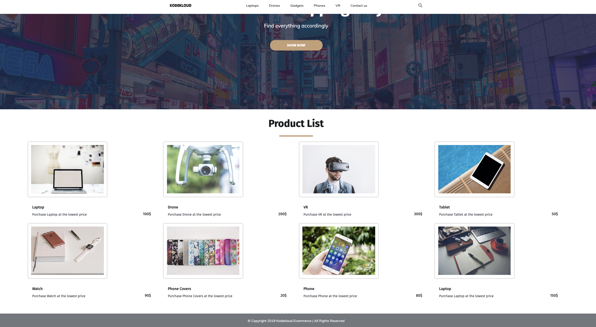

# ansible-for-absolute-beginners-project

This project presents the solutions for the Udemy course project:

- [Ansible: For Absolute Beginners Course](https://www.udemy.com/course/learn-ansible/)
- [Ansible: For Absolute Beginners Course: Learning App Ecommerce Project](https://github.com/kodekloudhub/learning-app-ecommerce)

It was developed using:
- [VirtualBox using NAT adapter and Port Forwarding](https://www.virtualbox.org/)
- [SSH for remote access using VSCode](https://code.visualstudio.com/docs/remote/ssh)

Webpage being portforwaded from Guess port 80 to Host port 3000:

